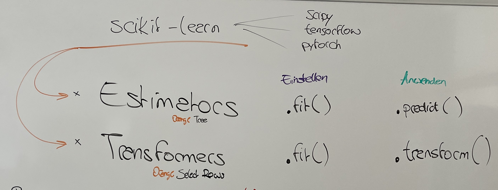
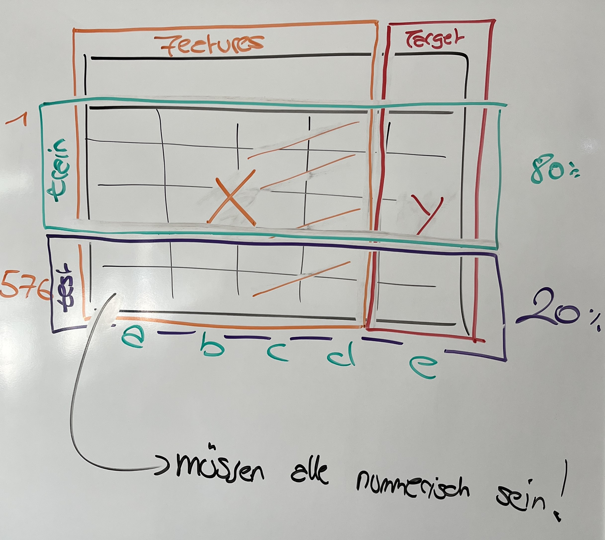

# Machine Learning Cheat-Sheet

Hier habe ich uns einen Cheatsheet mit den wichtigsten Funktionen und Klassen für's Machine Learning zusammengestellt. Außerdem habe ich euch unterhalb unsere beiden Tafelbilder vom dritten Termin eingefügt. Im ersten Bild seht ihr eine Erklärung zu den zentralen Klassen in `scikit-learn` - den Estimators und den Transformers.



Im zweiten Bild habe ich dargestellt, wie wir unsere Daten für das Machine Learning aufbereiten. Wir teilen dazu unsere Daten einmal horizontal (in `X` und `y`), und außerdem noch vertikal in einen Trainings- und einen Test-Datensatz. Als Ergebnis davon erhalten wir folgende Objekte: `X_train`, `X_test`, `y_train` und `y_test`. Das horizontale Teilen können wir am einfachsten mit pandas lösen; das vertikale Teilen mit Hilfe der `train_test_split()`-Methode.



## `scikit-learn` Navigator

Hier habe ich euch die wichtigsten Machine Learning Werkzeuge aus `scikit-learn` zusammengefasst.

```python
# Transformer/Funktionen zur Vorverarbeitung
from sklearn.impute import SimpleImputer
from sklearn.preprocessing import LabelEncoder
from sklearn.model_selection import train_test_split

# Estimators für das Clustering
from sklearn.cluster import AgglomerativeClustering
from sklearn.cluster import KMeans

# Estimators für die Klassifikation
from sklearn.tree import DecisionTreeClassifier, plot_tree
from sklearn.neighbors import KNeighborsClassifier

# Klassifikationsmetriken
from sklearn.metrics import f1_score
from sklearn.metrics import confusion_matrix
from sklearn.metrics import accuracy_score
from sklearn.metrics import recall_score
from sklearn.metrics import precision_score
from sklearn.metrics import classification_report

# Estimators für die Regression
from sklearn.tree import DecisionTreeRegressor
from sklearn.linear_model import LinearRegression

# Metriken für die Regression
from sklearn.metrics import r2_score
from sklearn.metrics import mean_squared_error
from sklearn.metrics import mean_absolute_error
from sklearn.metrics import root_mean_squared_error
```

## `scipy` Navigator

Hier habe ich euch die wichtigsten Machine Learning Werkzeuge aus `scipy` zusammengefasst.

```python
from scipy.cluster import hierarchy
```
