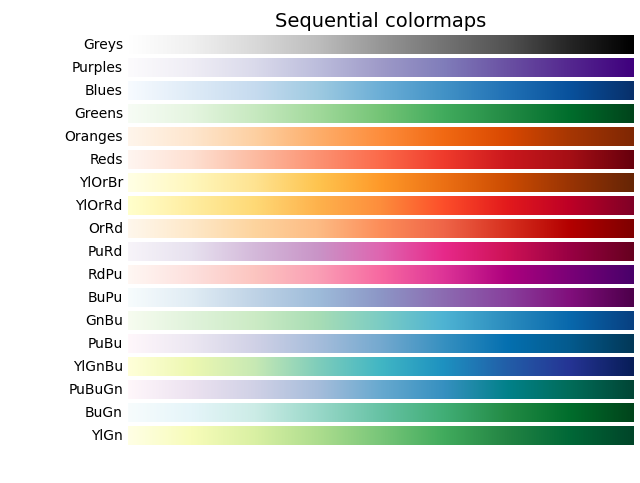

# Plotting in Pandas: Eine Kurze Einführung

Pandas bietet leistungsstarke Funktionen zur Visualisierung von Daten, indem es auf die Matplotlib-Bibliothek zugreift. Mit der `.plot()`-Methode können Daten einfach in verschiedene Diagrammtypen umgewandelt werden.

## Grundlegende Nutzung

Die `DataFrame.plot()`- und `Series.plot()`-Methoden ermöglichen schnelle Visualisierungen:

```python
import pandas as pd
<<<<<<< HEAD
from seaborn import heatmap

# Beispiel-Daten
data = pd.DataFrame({
=======
import matplotlib.pyplot as plt

# Beispiel-Daten
df = pd.DataFrame({
>>>>>>> ebc4281 (cleaned blank lines)
    'Jahr': [2020, 2021, 2022, 2023, 2024],
    'Umsatz': [100, 150, 200, 250, 300]
})

# Linienplot
<<<<<<< HEAD
data.plot(x='Jahr', y='Umsatz', kind='line', marker='o', title='Umsatzentwicklung')
=======
df.plot(x='Jahr', y='Umsatz', kind='line', marker='o', title='Umsatzentwicklung')
plt.show()
>>>>>>> ebc4281 (cleaned blank lines)
```

## Diagrammtypen

Pandas unterstützt verschiedene Diagrammtypen durch den `kind`-Parameter:

- **'line'** – Linienplot (Standard)
- **'bar'** – Säulendiagramm
- **'barh'** – Horizontalbalkendiagramm
- **'hist'** – Histogramm
- **'box'** – Boxplot
- **'scatter'** – Scatterplot (`x` und `y` müssen explizit angegeben werden)
- **'pie'** – Kreisdiagramm (nur für `Series` sinnvoll)

```python
# Balkendiagramm
<<<<<<< HEAD
data.plot(kind='bar', x='Jahr', y='Umsatz', title='Umsatzvergleich')
=======
df.plot(kind='bar', x='Jahr', y='Umsatz', title='Umsatzvergleich')
plt.show()
>>>>>>> ebc4281 (cleaned blank lines)
```

## Anpassung der Plots

- **Farben & Stile**: Über `color` und `style` anpassbar
- **Achsentitel & Legenden**: Über `xlabel`, `ylabel` und `legend()`
- **Größe & Layout**: `figsize=(width, height)`

```python
<<<<<<< HEAD
data.plot(
    kind='scatter',
    x='Jahr',
    y='Umsatz',
    color='red',
    title='Streudiagramm',
    xlabel='Jahr',
    ylabel='Umsatz'
)
=======
df.plot(kind='scatter', x='Jahr', y='Umsatz', color='red', title='Streudiagramm')
plt.xlabel('Jahr')
plt.ylabel('Umsatz')
plt.grid(True)
plt.show()
>>>>>>> ebc4281 (cleaned blank lines)
```

## Farben im Plot

Als Farben steht eine breite Palette an Optionen zur Verfügung. Zum einen können Hex-Farben (z.B. `#123456`) verwendet werden. Zum anderen unterstützt `matplotlib` darüber Hinaus eigene Farben:


<<<<<<< HEAD
Diese Farben können bei konventionellen Plots eingesetzt werden, bei denen Datenpunkte mit einer Farbe eingefärbt werden sollen. Alternativ dazu bietet `pyplot` auch Color-Maps an, die zu Einfärben von Plots genutzt werden können, die mit Farbbereichen arbeiten. Zu diesen Plots gehören die `heatmap` und die `clustermap`, die wir durch Seaborn geladen hatten. Hier ein einblick in gängige Color-Maps:



Unterhalb habe ich ein kleines Code-Beispiel eingefügt, das zeigt, wie eine Color-Map in einem Heatmap-Plot eingestellt werden kann:

```python
heatmap(data.corr(), cmap="Greys")
```

=======
>>>>>>> ebc4281 (cleaned blank lines)
## Zusammenfassung

Pandas macht das Plotten einfach und intuitiv, insbesondere für schnelle Datenanalysen. Fortgeschrittene Anpassungen können durch direkte Matplotlib-Nutzung erfolgen.
